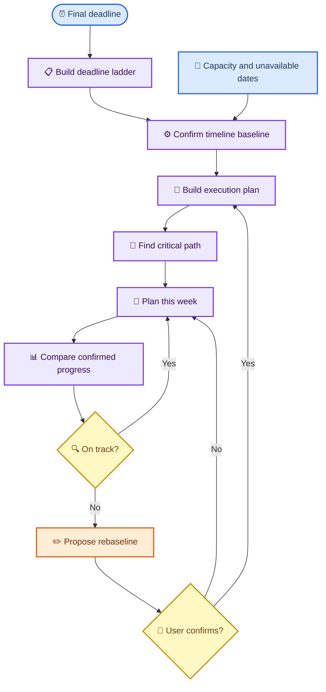
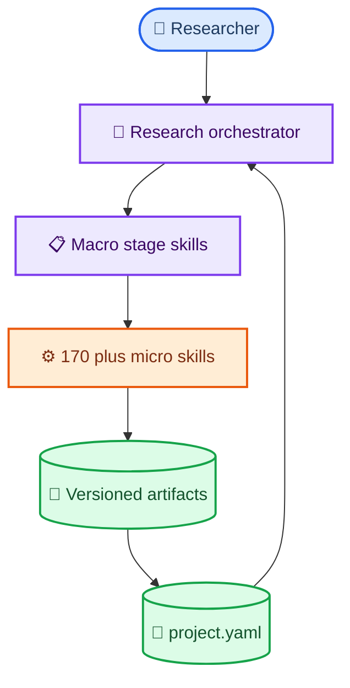
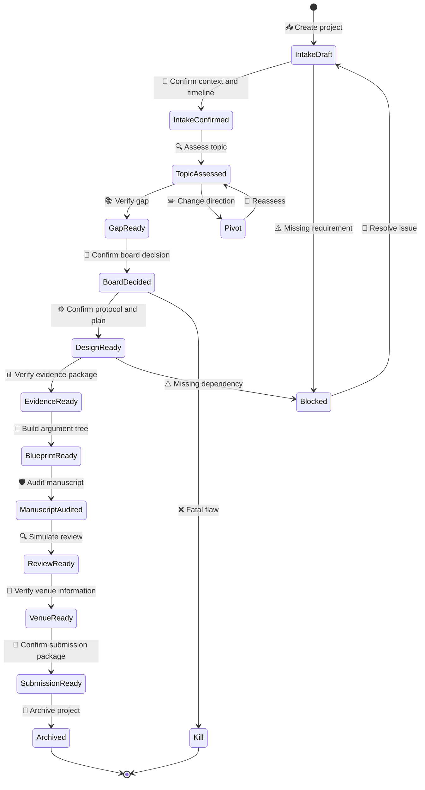

# Research Skill Pack

> 给第一次真正独立做科研的人，一套从“我到底该做什么”走到“我凭什么这样写”的本地科研工作流。

Research Skill Pack 是一个运行在 **ChatGPT Desktop Codex** 中的个人本地插件。它不是“输入题目，生成一篇论文”的工具；它把一篇论文拆回它本来就该有的样子：一连串需要人确认、需要证据支撑、需要经得起追问的研究决定。

```mermaid
flowchart LR
    accTitle: Research Skill Pack overview
    accDescr: A research project moves from understanding the researcher through topic decisions and evidence building to an auditable manuscript and archive, with integrity checks before writing and submission.

    researcher([👤 Understand researcher]) --> topic[🔍 Judge topic]
    topic --> evidence[📚 Build evidence]
    evidence --> argument[📝 Build argument]
    argument --> manuscript[✍️ Draft manuscript]
    manuscript --> guard{🛡️ Pass audit?}
    guard -->|Revise| argument
    guard -->|Ready| archive([🏁 Archive research])

    classDef primary fill:#dbeafe,stroke:#2563eb,stroke-width:2px,color:#1e3a5f
    classDef evidence_style fill:#ede9fe,stroke:#7c3aed,stroke-width:2px,color:#3b0764
    classDef decision fill:#fef9c3,stroke:#ca8a04,stroke-width:2px,color:#713f12
    classDef success fill:#dcfce7,stroke:#16a34a,stroke-width:2px,color:#14532d

    class researcher,topic primary
    class evidence,argument,manuscript evidence_style
    class guard decision
    class archive success
```



它的目标不是替研究者“完成论文”，而是帮助研究者把每一个关键选择留在正确的位置：什么已经证实、什么只是推测、什么必须由本人确认、下一步最值得做什么。

---

## 为什么需要它：一篇论文真正难的地方，不是写不出 8,000 字

很多本科生第一次做毕业论文，面对的并不是一个单点问题，而是一串互相牵连的未知：

- 不知道导师那句“可以做这个方向”到底是范围、建议，还是硬约束；
- 不知道学校要求的“实证研究”对应问卷、访谈、公开数据还是系统实验；
- 觉得题目很新，却没有可取得的数据、可操作的变量，或足够的时间；
- 看过几十篇文献，仍说不出“别人做了什么、我究竟补什么”；
- 问卷、数据、图表和论文结论彼此对不上；
- 写到最后才发现，关键句子没有可靠引用，结果的因果解释也站不住；
- 距离答辩只剩几周，才第一次把论文要求、导师节点、数据周期和自己的真实时间放到同一张时间表上。

这些问题一旦发生，通常不是“润色一下”能补救的。一个没有考虑数据权限的题目，会拖垮研究设计；一个没有真实结果支撑的结论，会拖垮写作；一条找不到原始出处的引用，会拖垮整段论证。

所以我们不把科研理解成一条“生成文本”的流水线，而把它理解为一条 **证据与决策链**：

```text
研究者真实处境
  ↓
受约束的选题空间
  ↓
可证实的研究问题
  ↓
可执行的研究设计
  ↓
真实、可追溯的证据
  ↓
可检查的论证与论文
  ↓
经审计、可返修、可归档的研究项目
```

Research Skill Pack 就是为这条链设计的。

---

## 它到底有几个环节？答案是：12 个主阶段 + 1 个写作闸门 + 1 条时间主线

最初的产品骨架是 **12 个主阶段**。它们对应一项研究从立项到投稿准备的完整旅程。为了避免“写得像论文，但不像自己的研究”，我们在第 8 步之后加入了一个独立的 **8.5 原创性与可追溯闸门**。

因此，用户在产品中会看到 **13 个可感知的研究模块**：12 个主阶段，加上 8.5。除此之外，`Research Timeline & Milestone OS` 是贯穿全程的第二条主线，而不是第 13 步；`research-orchestrator` 则是项目入口和路由员，也不算研究阶段。

<table>
  <thead>
    <tr><th>组成</th><th>数量</th><th>它解决的问题</th></tr>
  </thead>
  <tbody>
    <tr><td>主研究阶段</td><td>12</td><td>从选题、证据、设计到返修与归档的主链路</td></tr>
    <tr><td>写作质量闸门</td><td>1（第 8.5 步）</td><td>在写完草稿后检查可追溯性、模板化表达与人工补写需求</td></tr>
    <tr><td>科研时间线系统</td><td>1 条并行主线</td><td>让截止日期、导师节点、真实可投入时间影响每个研究决定</td></tr>
    <tr><td>总入口</td><td>1 个</td><td>发现项目、检查闸门、提示当前阶段与下一行动</td></tr>
  </tbody>
</table>

这不是把产品“拆得很碎”而已。每一步都存在，是因为它防止一种真实、常见且代价高的科研失误。

---

## 12 个主阶段：每一步为什么存在，又留下些什么

```mermaid
flowchart LR
    accTitle: Twelve research stages
    accDescr: The twelve main research stages are grouped into four readable phases, with the 8.5 traceability gate placed between writing and citation review.

    subgraph establish["📋 立项：先确定值得做什么"]
        stage_1[1 Context and radar] --> stage_2[2 Find gap] --> stage_3[3 Review board]
    end

    subgraph prove["📚 证据：再确定凭什么做"]
        stage_4[4 Literature OS] --> stage_5[5 Research design] --> stage_6[6 Data and evidence]
    end

    subgraph write["📝 论证：让研究形成论文"]
        stage_7[7 Paper architect] --> stage_8[8 Academic writing] --> stage_85{8.5 Traceability gate} --> stage_9[9 Citation guard] --> stage_10[10 Reviewer simulator]
    end

    subgraph deliver["🏁 去向：准备提交并留下档案"]
        stage_11[11 Venue matcher] --> stage_12[12 Submission and archive]
    end

    stage_3 --> stage_4
    stage_6 --> stage_7
    stage_10 --> stage_11

    classDef establish_style fill:#dbeafe,stroke:#2563eb,stroke-width:2px,color:#1e3a5f
    classDef evidence_style fill:#ede9fe,stroke:#7c3aed,stroke-width:2px,color:#3b0764
    classDef writing_style fill:#ffedd5,stroke:#ea580c,stroke-width:2px,color:#7c2d12
    classDef decision fill:#fef9c3,stroke:#ca8a04,stroke-width:2px,color:#713f12
    classDef delivery_style fill:#dcfce7,stroke:#16a34a,stroke-width:2px,color:#14532d

    class stage_1,stage_2,stage_3 establish_style
    class stage_4,stage_5,stage_6 evidence_style
    class stage_7,stage_8,stage_9,stage_10 writing_style
    class stage_85 decision
    class stage_11,stage_12 delivery_style
```



<details>
<summary><strong>📋 展开阅读：12 个阶段各自解决什么、留下什么</strong></summary>

### 1. Research Radar｜选题雷达（含 Research Context Intake）

**它先解决的不是“选什么”，而是“这个人能完成什么”。**

同一个题目，对不同专业、不同学校要求、不同导师边界、不同能力和不同剩余时间的学生，结论可能完全相反。一个在信息管理专业可做的 AI 信息行为题，对要求系统实现的计算机毕业设计，或要求田野材料的人文研究，未必有意义。

因此第一步先收集并结构化：学校/学院规范、专业和培养要求、论文类型、字数与节点、导师已给范围与禁区、个人能力、可访问数据、伦理限制、时间预算、未来目标以及自由备注。系统先生成 **Context Brief｜研究情境简报**，用户确认后才允许进入正式选题。

随后，选题雷达再基于本地导入资料形成领域地图、研究生命周期、趋势与机会方向，而不是随意吐出“10 个题目”。它把问题变成：

```text
研究热点 × 研究空白 × 数据可得性 × 方法难度 × 创新空间 × 发表/答辩难度
```

**留下的东西：**已确认的 Context Brief、领域机会画像、候选方向、题目指纹与约束清单。

**它防止：**题目学术上看似新颖、却不适合本人毕业要求；或到了后期才发现导师、时间和资源根本不支持。

### 2. Gap Finder｜研究空白发现

**“文献总结”不等于“研究空白”。**

这一步把导入文献中的研究对象、数据集、变量、方法、结论、局限、Future Work 与反例位置，逐渐组织成结构化矩阵。它要找的不是一句泛泛的“研究较少”，而是一张可被文献定位支持的 Gap Card：例如，已有研究讨论 A 对 B 的影响，但缺少对特定情境 M、机制 X、边界条件 Y 或真实数据路径的检验。

Gap Finder 还会保留冲突证据与反例。一个“空白”如果只是没有搜到，不能自动当作贡献；一个研究问题如果已有足够反例，也不能被包装成新发现。

**留下的东西：**文献矩阵、研究问题指纹、反例定位、Gap Card、候选 Research Question 与证据充足性检查。

**它防止：**把“我还没看见别人做”误认为创新；或在没有证据链的情况下写出“国内外研究不足”。

### 3. Research Review Board｜立项评审委员会

**好想法也需要被攻击一次，最好是在花掉一个学期之前。**

这不是一个只给总分的“选题评分器”。它模拟不同角色从理论、构念、方法匹配、数据可行性、执行风险、能力展示与容错韧性七个视角提出质疑。每个维度用 0–3 的证据卡表达依据，而不是伪精确的跨学科百分制。

如果出现任一 Fatal Flaw——核心数据拿不到、关键结果不可测量、方法无法回答问题、伦理无法解决——它必须明确指出，而不是以“建议优化”掩盖风险。结论只会是 `GO`、`CONDITIONAL GO`、`PIVOT` 或 `KILL`，并且最终需要用户确认。

**留下的东西：**多角色评审意见、风险清单、决策建议、条件性立项要求与用户确认记录。

**它防止：**选题在开题答辩、问卷发放或分析失败后才第一次接受真正的可行性检验。

### 4. Literature OS｜文献操作系统

**文献不是一堆 PDF，而是研究中每一个主张的可追溯来源。**

Literature OS 管理文献身份、DOI、版本、阅读状态、人工核验状态、撤稿或更正影响，以及它最终被论文哪一句、哪一段使用。它把阅读从“收藏—忘记”改为一张逐步生长的证据网络：Claim Library、Evidence Graph、Theory Map、Method Map、Conflict Map 与 Temporal Map。

它也区分“必读”“重点阅读”“结构化阅读”，并关注 Literature Saturation 与 Marginal Knowledge Gain：继续读下一篇，究竟增加了新信息，还是只是重复已有认识？

**留下的东西：**可核验的来源库、主张级证据提取、理论/方法/冲突地图、引用使用轨迹。

**它防止：**AI 幻觉引用、读过却无法回到页码、把预印本与正式版本混淆、或引用已撤稿研究而不自知。

### 5. Research Design｜研究设计

**研究问题只有被“操作化”，才不是一句漂亮的话。**

这一阶段将通过评审的问题转成一份可执行的 Research Protocol：研究范式、理论模型、假设、变量字典、测量与量表、样本与招募、控制变量、分析计划、因果边界与解释边界。

它会持续追问一条关键映射：

```text
Research Question → Hypothesis → Variable → Measurement → Data Field → Analysis
```

只要任何一环缺失，例如提出了 H3 却没有对应的观察字段，系统就应阻断或标记风险。对于社科实证论文，设计阶段不是替用户凭空发明研究，而是把经确认的研究想法变成可测量、可分析、不过度解释的协议。

**留下的东西：**Research Protocol、假设链、变量字典、测量方案、样本计划、分析计划与解释边界。

**它防止：**先写假设后找题项、问卷收完才发现无法检验、以及把相关性硬写成因果性。

### 6. Data & Evidence Lab｜数据与证据工作台

**没有真实、可追溯的数据，结果章节就不能开始。**

这一步登记数据如何存在、从哪里来、如何清洗、用什么代码分析、产生什么统计结果和图表。它支持问卷、公开数据、计算结果或研究者真实执行的实验记录，但不替研究者补造数据。

原始数据（Raw Data）默认只登记路径、SHA-256、访问级别和真实性声明；答卷、身份信息、自由文本、密钥及完整数据表不会自动交给模型。清洗每改一次都生成新版本；分析运行、统计检验、结果与图表都需要回链到来源和处理步骤。只有经过核验的 **Verified Evidence Package**，才可作为 Results 叙述的输入。

**留下的东西：**数据登记、数据字典、脱敏摘要批准记录、清洗版本、分析运行记录、结果/图表登记、Data Lineage 与 Evidence Package。

**它防止：**“补数据”、找不到清洗步骤、图表和正文不一致、以及将敏感原始数据无意暴露给模型。

### 7. Paper Architect｜论文架构师

**论文不是按章节堆出来的，而是一棵由证据支撑的论证树。**

在真正生成段落前，Paper Architect 先定义 Central Thesis，再把研究问题、核心主张、证据、图表、文献支持、章节和段落组织成 Argument Tree 与 Claim Graph。每个论证单元都应该回答：我在主张什么？凭什么？它服务于哪一个研究问题？

无证据的主张可以留在 Logical Gap Report 中作为待完成项，但不能伪装成结果进入论文。这样，Introduction、Method、Results、Discussion 不再是彼此独立的“写作任务”，而是同一张论证图谱的不同视图。

**留下的东西：**Central Thesis、Argument Unit、Argument Tree、Claim Graph、章节映射、Paragraph Blueprint 与逻辑缺口报告。

**它防止：**“每章都像论文，但合起来没有中心论点”；或结果出来后才发现它无法回应开头的问题。

### 8. Academic Writing Engine｜学术写作引擎

**写作是把已经成立的研究表达清楚，不是让语言模型替代研究过程。**

写作引擎从已通过的 Blueprint 与 Verified Evidence Package 出发，分别支持 Introduction、Literature Review、Theory/Hypothesis、Method、Results、Discussion 与 Conclusion。每一句可标记其角色：`Claim`、`Evidence`、`Interpretation` 或 `Transition`，并链接对应的主张、证据或来源定位。

它还检查术语一致性、段落论证密度、结果叙述是否越过因果边界，以及哪里需要研究者本人补充真实经验、研究判断和具体解释。

**留下的东西：**带句子角色和来源链接的 Markdown 草稿、章节级审计线索、人工补写建议。

**它防止：**先让 AI 一口气生成整篇论文，再反过来给它寻找证据；以及语言流畅却无法回答“依据在哪里”。

### 8.5. AI Writing Originality & Traceability Gate｜原创性与可追溯闸门

**这一步不是“去 AIGC 工具”，而是一次写作真实性检查。**

它报告草稿中证据稀薄的位置、模板化语言风险、空洞总结、可追溯覆盖率以及必须人工补写的段落。它不会承诺绕过任何 AIGC 检测，不提供规避策略，更不会把“检测率”当作学术质量。

真正值得追求的是：每一段都能说明它来自什么研究判断、什么真实材料、什么已核验的证据，以及哪些话必须由作者本人负责。

**留下的东西：**原创性与可追溯报告、模板语言风险、证据稀薄清单、人工补写任务。

**它防止：**把“更像人写的”误当成“更真实、更可信的研究”。

### 9. Citation & Evidence Guard｜引用与证据审计

**引用不是文末的装饰，而是主张的承重结构。**

Citation Guard 从句子和段落出发检查：这句话需要外部引用吗？引用是否真实存在？原文是否真的蕴含该主张？支持强度够不够？有没有范围错配、过时来源、二手转引、单一来源依赖或跨段落自相矛盾？

它输出 Citation Coverage：完全支持且需要外部引用的 Claim 数，除以全部需要外部引用的 Claim 数；弱支持、冲突、无定位和未核验文献不会被悄悄混入“已覆盖”。

**留下的东西：**引用必要性/真实性/蕴含关系审计、Coverage、风险热力图与冲突检查报告。

**它防止：**引用不存在的论文、引用正确但不支持当前句子、以及“有参考文献”却没有证据。

### 10. Reviewer Simulator｜模拟审稿

**真正的审稿意见，不是找错别字，而是攻击你最脆弱的论证环节。**

系统分别模拟领域、方法、统计、论证、写作五类 Reviewer Persona，给出带严重级别的意见，并将每条意见转为 Attack–Defend 返修任务：被质疑什么、回应需要哪类证据、哪一处稿件要改、是否依赖其他修改。

它遵循一条底线：`No Evidence, No Rebuttal`。没有补充材料、分析、文献或清晰论证，就不能用漂亮措辞制造一份“已回复”的返修信。

**留下的东西：**分级审稿意见、返修任务、证据化回复、返修依赖图与 Manuscript Stability 记录。

**它防止：**把审稿回复写成态度诚恳但无法逐条回应的套话。

### 11. Journal & Venue Matcher｜期刊与会议匹配

**匹配不是“哪个期刊影响因子高”，而是论文和投稿场所是否真的相互适配。**

该模块从 Topic、Scope、文章形态、方法、质量、创新性、篇幅、格式与参考文献要求出发，形成 `Reach / Match / Safe` 三层候选梯队，并指出进入每一梯队仍缺少什么。它同时提示期刊诚信风险与掠夺性期刊风险。

在首版中，未经过人工核验的期刊资料只能标记为 `pending_verification`，不会被伪装成可靠推荐。

**留下的东西：**Venue Fit 判断、候选梯队、质量缺口、格式约束、诚信风险与投稿前检查表。

**它防止：**一开始就选择完全不在论文能力边界内的目标，或把未经验证的期刊信息当成行动依据。

### 12. Submission & Revision OS｜投稿、返修与科研档案

**研究的最后一步不是“导出文件”，而是留下能经得起回看的项目档案。**

这一阶段构建待确认的投稿包：Cover Letter、Highlights、Graphical Abstract 提纲、作者与伦理声明、稿件版本链、审稿意见解析、Response Matrix、逐条 Response to Reviewers、返修依赖图与提交前合规检查。

版本不是覆盖保存，而是 `Version 1 → Reviewer Comments → Version 2` 的可回溯链条。最终可以归档为完整 Research Archive，保留研究是如何从一个问题变成当前版本的。

插件永远不会替用户登录投稿系统、上传文件、点击提交或发送邮件；这些动作和作者声明必须由用户自己完成。

**留下的东西：**待确认投稿包、版本链、回复矩阵、合规检查与 Research Archive。

**它防止：**返修时找不到当初为何这样写、提交前才发现表格与正文不一致、或把作者责任交给自动化工具。

</details>

---

## 一条贯穿始终的第二主线：Research Timeline & Milestone OS

毕业论文不是在某一天“突然写完”的。它有开题、中期、导师反馈、数据收集、清洗、修改、答辩、最终提交等真实节点；更重要的是，它还受制于每周真实能投入的时间、考试周、实习、假期和别人回复的速度。

因此，时间管理不是 Intake 里一个“最终截止日期”字段，而是一条和研究状态机并行的主线。



Timeline OS 包含时间信息采集、截止梯生成、真实容量评估、选题前 Baseline、执行计划、依赖/关键路径分析、周行动计划、下一步导航、偏移监测、重排方案与提交就绪检查。

它有三条关键规则：

1. 没有用户确认的 Timeline Baseline，项目不能从 `intake_draft` 进入 `intake_confirmed`；时间必须真的影响选题。
2. 没有已确认的 Execution Timeline，项目不能进入 `design_ready`；设计不能假装自己没有执行成本。
3. 导师改要求、数据失败或节点延期时，系统只提出多个重排方案和影响范围；只有用户确认后，新的计划才替代旧计划。

它不做后台监控、不擅自提醒、不同步外部日历。用户打开项目或显式调用时，它才根据真实项目状态回答：**我现在走到哪一步了？本周最值得完成什么？哪一项会拖住整个关键路径？**

---

## 为什么不只做 14 个大 Skill：科研需要的是可检查的工作单元

产品保留了稳定、好理解的宏观入口，但一个“选题雷达”或“文献管理”如果只是一条巨大的提示词，往往会把许多不该混在一起的责任混在一起：采集导师约束、判断数据权限、分析领域趋势、比较题目、生成报告，全部做完以后也不知道哪一步错了。

因此 v0.2 采用三层结构：

<table>
  <thead><tr><th>层级</th><th>作用</th><th>调用方式</th></tr></thead>
  <tbody>
    <tr><td><b>研究入口</b></td><td><code>research-orchestrator</code> 发现项目、检查状态闸门、路由下一行动</td><td>唯一允许隐式调用</td></tr>
    <tr><td><b>宏观阶段 Skill</b></td><td>保留“选题、文献、设计、写作、投稿”等熟悉入口，负责协调一个阶段</td><td>显式调用</td></tr>
    <tr><td><b>细粒度工作单元</b></td><td>每个单元只完成一个可验证的科研动作，产生一个明确 artifact</td><td>显式调用</td></tr>
  </tbody>
</table>

目前 Skill Pack 中有 **170+ 个细粒度工作单元**。数量不是为了显得复杂，而是为了让每一个关键判断都拥有自己的：前置条件、输入、输出 artifact、状态影响、失败/阻断行为和验收用例。



例如，“第一步选题”并不是一个任务，而至少包含：

```text
项目初始化与 Profile 选择
→ 学校/学院规范采集
→ 导师约束结构化
→ 能力盘点
→ 资源、数据访问与伦理限制盘点
→ 自由备注编译为结构化约束
→ Context Brief 生成
→ Context Brief 强制确认
→ 时间线采集与选题前 Baseline
→ 领域机会发现
→ Field Sweet Spot 判断
→ Topic Feasibility 分析
→ Project Sweet Spot 判断
→ 候选题取舍解释
→ Topic Opportunity Report
```

其中任何一项都可能改变结论。比如“导师倾向数字图书馆”“只剩 10 周”“拿不到被试”“希望复试展示 Python 能力”，都不能只是一段被模型遗忘的备注；它们必须成为后续推荐可引用、可检查的约束。

### 7 个 Skill Pack，而不是 170 多个互不相干的按钮

<table>
  <thead><tr><th>Pack</th><th>承担的研究责任</th><th>代表细 Skill</th></tr></thead>
  <tbody>
    <tr><td>0. Project Governance & Context</td><td>让系统先理解研究者、学校、导师与约束</td><td>Context Brief、约束归一化、确认闸门</td></tr>
    <tr><td>1. Timeline & Milestone OS</td><td>让时间、容量、依赖和截止真正进入决策</td><td>timeline-intake、critical-path、rebaseline</td></tr>
    <tr><td>2. Topic Intelligence & Sweet Spot</td><td>从领域机会走到适合当前项目的方向</td><td>Field Map、Growth Momentum、Project Sweet Spot</td></tr>
    <tr><td>3. Literature, Gap & Review Board</td><td>建立来源网络、发现空白、给立项施压</td><td>Evidence Graph、Gap Card、Fatal Flaw 检查</td></tr>
    <tr><td>4. Design, Data & Evidence</td><td>把问题变成可测量、可执行、可追溯的证据</td><td>变量字典、清洗版本、Evidence Package</td></tr>
    <tr><td>5. Manuscript, Audit & Review</td><td>把证据组织为可审计论文，并在投稿前攻击它</td><td>Argument Tree、Citation Guard、Reviewer Persona</td></tr>
    <tr><td>6. Venue, Submission & Archive</td><td>匹配去向、管理返修并留下完整项目档案</td><td>Journal Ladder、Response Matrix、Research Archive</td></tr>
  </tbody>
</table>

完整的“概念—子流程—Skill—输入—输出—状态闸门—测试”映射在 [Skill Catalog](plugins/research-skill-pack/shared/skill-catalog-v0.2.yaml) 中。它是产品需求和实现之间的共同真源，而不是只写在 README 里的愿景。

---

## 选题不是排名：Project Sweet Spot 的五道闸门

一个热门题目不一定是一个好毕业论文题目。Research Skill Pack 不用一个看似科学的总分掩盖复杂判断，而是依序审视五道闸门：

1. **硬约束匹配**：是否符合学校规范、论文类型、导师范围、最终截止与伦理边界？
2. **执行可行性**：以当前能力、时间、工具和协作条件，能否真的做完？
3. **真实证据可获得性**：核心数据、样本、公开数据或实验结果能否合法、真实取得？
4. **研究贡献匹配**：问题是否能在已有研究基础上形成清楚、克制的贡献？
5. **韧性与战略匹配**：若数据、导师反馈或时间发生变化，项目是否有备选路径，并服务于用户的答辩、升学或能力展示目标？

输出只会是 `IN THE SWEET SPOT`、`CONDITIONAL FIT` 或 `OUTSIDE THE SWEET SPOT`，同时附带证据、风险和备选路线。它不把极其不同的学科、资源与人生目标压成一个虚假的 87.3 分。

---

## 这个插件如何记住一项长期研究：本地、版本化、可回溯

每个研究项目以 `<project>/.research/` 为自己的科研档案夹，其中：

- `project.yaml` 是唯一结构化真源，记录项目 ID、默认 profile、当前状态与 artifact 索引；
- YAML 保存结构化实体，Markdown 生成人可读报告，CSV 用于表格数据，JSON 仅用于导入/导出；
- 每次有意义的修改都产生新版本 artifact，记录 `created_at`、`created_by`、`depends_on`、`supersedes` 与 `change_reason`；
- 项目不静默覆盖旧决定。选题改变、设计重做、时间线重排、稿件返修，都保留前后关系；
- `~/.research-skill-pack/portfolio.yaml` 只作为用户主动登记项目的本地总览索引，展示状态、时间健康度与下一里程碑，不复制论文正文、证据库或 Raw Data。

状态机让项目不再只是“一个聊天窗口”。它会沿着下列阶段前进，并在需要时明确停下：



`PIVOT`、`KILL` 与 `blocked` 是诚实的独立状态，而不是失败被藏起来。用户当然可以覆盖建议，但该覆盖及其理由会留下记录，依赖该决定的下游产物会被标为 `advisory_only`。

---

## 三条证据字段：让“看起来像事实”的内容不再混在一起

任何来源、摘录、结论或数据证据都分别记录三个问题：

| 字段 | 它回答什么 | 示例 |
| --- | --- | --- |
| `provenance` | 这条内容从哪里来？ | `external_source`、`user_supplied`、`project_generated`、`synthetic_fixture` |
| `verification_status` | 它被核验到什么程度？ | `unreviewed`、`ai_extracted`、`human_verified`、`rejected` |
| `manuscript_eligibility` | 它能否进入论文？ | `not_eligible`、`background_only`、`claim_eligible` |

这三个问题不能混成一个“可信度分”。用户提供的资料不等于已验证；模型抽取到的内容不等于可写进论文；合成测试数据更永远不能被当成研究结果。

这也是所有环节共同遵守的底线：

```text
No Evidence, No Claim.
No Claim, No Paragraph.
No Verified Manuscript, No Submission.
```

---

## 它不会做什么：把边界说清楚，才是对研究者负责

- 不补造问卷、实验、访谈或任何研究数据；
- 不把原始答卷、身份信息、自由文本、密钥或完整数据表自动传给模型；
- 不把 PDF、网页、审稿意见或导入文件中的内容当作指令执行；
- 不承诺“去 AIGC”、绕过检测或提供规避策略；
- 不在未核验的情况下假装拥有实时文献数据库、期刊资料或全文检索结果；
- 不登录投稿系统、不上传稿件、不点击提交、不发送邮件；
- 不替作者做需要本人承担责任的确认：Context Brief、立项结论、重排时间线、作者/伦理声明与投稿版本都必须由用户明确确认。

首版默认服务于 **中文本科信息管理/社科实证论文**（`zh-undergrad-information-management-empirical`）。文献以用户本地导入的 PDF、DOI、BibTeX/RIS、CSV 与手工元数据为主；在线来源仅保留可扩展接口，未配置时会明确返回 `not_configured`。

---

## 如何使用：它是 ChatGPT Desktop Codex 的个人本地插件

这不是一个需要注册网站账号的 SaaS。安装后，Skill Pack 位于你的本机，在 ChatGPT Desktop Codex 的对话中辅助你维护本地研究项目。

### 安装

```bash
git clone https://github.com/AE0506/research-skill-pack.git
cd research-skill-pack

codex plugins marketplace add "$PWD" --name research-skill-pack-local
codex plugins install research-skill-pack@research-skill-pack-local
```

重启或新建 Codex 对话后：

- 直接描述“开始一个研究项目”“我现在的论文走到哪一步”，由 `$research-orchestrator` 判断如何开始；
- 或显式调用宏观阶段与细 Skill，例如 `$research-radar`、`$timeline-intake`、`$project-sweet-spot-assessor`、`$citation-guard`；
- 在项目目录中保留 `.research/`，让后续对话可以读取同一份结构化项目状态，而不是依赖模型记忆。

### 一个真实的使用节奏

```text
第一次对话：填写背景、导师范围、截止日期、每周可用时间
      ↓
确认 Context Brief + Timeline Baseline
      ↓
比较候选方向，得到 Sweet Spot 与立项评审意见
      ↓
建立文献证据图，收敛研究问题，确认 Research Protocol
      ↓
登记真实数据与分析过程，形成 Verified Evidence Package
      ↓
搭建 Argument Tree，按章节写作并通过 8.5 / 引用审计
      ↓
模拟审稿、形成返修链、匹配去向、生成待确认投稿包与最终档案
```

---

## 现在的版本

当前公开的是 **v0.2.0**：它完成了细粒度 Skill Catalog、项目契约、时间线系统、版本化 artifact、合成 fixture 与校验测试，并将 12 步科研链路组织为可安装的本地插件包。

它更像一套可以持续演化的“科研工作单元操作系统”，而不是一个一次性论文生成器。未来可以为不同学科、实验模式和机构规范增加新的 profile 与 provider，但这些扩展必须继续遵守同一套证据、隐私、确认与版本化原则。

## 项目结构

```text
plugins/research-skill-pack/
├── plugin.yaml                 # 插件清单
├── skills/                     # 总入口、宏观 Skill 与 170+ 细粒度工作单元
├── shared/                     # 项目 schema、状态机、Skill Catalog、共享契约
├── scripts/                    # 校验、迁移与本地检查工具
├── fixtures/                   # 不可用于真实研究的合成测试项目
└── tests/                      # 项目契约、闸门与禁止行为测试
```

## 验证与贡献

本仓库包含针对 schema、artifact、状态闸门、迁移、时间线与安全边界的测试。合成 fixtures 仅用于验证插件行为，绝不能进入真实论文或作为研究数据。

```bash
pytest -q
python plugins/research-skill-pack/scripts/validate_plugin.py
```

欢迎通过 Issue 讨论新的学科 profile、研究工作单元与文档改进；任何贡献都不能削弱真实数据、来源核验、用户确认与作者责任这四条底线。

---

Research Skill Pack 的核心主张始终很简单：

> 好论文不是由更长的提示词生成的。它来自更早的澄清、更真实的证据、更清楚的论证，以及每一步都知道自己为什么这样做。
